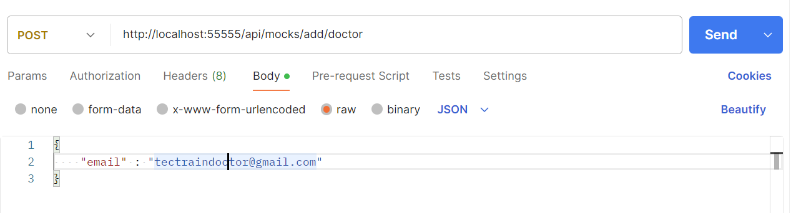

# Technical Interview Project

## Backend

The backend of this project is built with Node.js using the Express.js framework. The database is powered by Firebase, ensuring a robust and scalable data storage solution.

### Run on your local

To launch the local cloud functions, use the following commands:

```bash
# Start the authentication functions
npm run functions:auth

# Start the mock data functions
npm run functions:mocks

# Start the appointments functions
npm run functions:appointments

# Start the doctors functions
npm run functions:doctors
```

## Frontend

To launch the frontend project, follow these steps:

```bash
# Install npm packages
npm install

# Run frontend on dev
npm run dev
```

## Authentication

You can start the authentication process opening the frontend homepage, you would be redirected to the login page. You can login using these credentials based on the role (Patient/Doctor):

##### Patient:
Full name: John Doe
Email: tectrainpatient@gmail.com
Password: Test123456!

##### Doctor:
Full name: Mark Johnson
Email: tectraindoctor@gmail.com
Password: Test123456!

Using these credentials you will get mocked appointments, if you want to start with a clean solution you can sign-up (/signup).

**Note**: If you are sign-up as a doctor, after the registration please send a request to the mock endpoints to add available hourly slots to your account:



## Patient functionalities

After the login, the patient will be able to book appointments with doctors and see own upcoming/completed/canceled appointments.

The patient can:

- View Upcoming/Completed/Canceled appointments
- Search doctors ("/search") by specialty or name
- Select a doctor clicking on the card, viewing informations about him
- Schedule an appointment with the doctor selecting the day and the hour available

## Booking functionalities

- To schedule an appointment the patient can go to the doctor research, select a doctor and click on book a meeting
- If the user try to book a meeting already taken from another patient or by himself, he will get an error message.
- If the patient schedule an appointment, the appointment will appear also on the doctor appointment dashboard.


## Doctor functionalities

After the login, the doctor will be able to check in his calendar all the appointments related with the patient on the homepage.

The doctor can:

- View Upcoming/Completed/Canceled appointments related with the patient.

You can add some mocked appointments using this endpoint with the following body:


